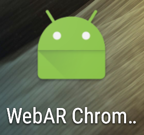
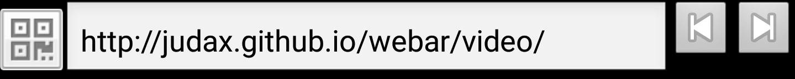

# Index

* [Overview](#overview)
* [Disclaimer](#disclaimer)
* [How to use this repo](#how_to_use_this_repo)
* [Using the Chromium WebAR prototype and the new APIs](#using_the_chromium_webar_prototype_and_the_new_apis)
  * [How to install and use the Chromium WebAR prototype](#how_to_install_and_use_the_chromium_webar_prototype_on_android)
  * [Examples](#examples)
  * [Overview of the WebAR APIs](#overview_of_the_webar_apis)
  * [Using the WebAR APIs in ThreeJS](#using_the_webar_apis_in_threejs)
* [How to build your own version of Chromium with WebAR](#how_to_build_your_own_version_of_chromium_with_webar)
* [Supported devices](#supported_devices)
* [License](#license)
* [Known issues](#known_issues)
* [Future work](#future_work)

# <a name="overview">Overview</a>

This project's goal is to provide an initial implementation of a possible Augmented Reality (AR) API for the Web on top of Chromium. The initial prorotype is built on top of the [Tango](https://get.google.com/tango/) platform for Android by Google. Maybe, more platforms will be supported in the future. There is a precompiled and working prototype you can use right away along with documentation of the APIs and some examples. There is also a tutorial on how to build your own version of modified Chromium with the WebAR APIs in it.

A major objective of this project is to get a conversation going on the subject of how to provide Augmented Reality capabilities to the web: WebAR.

# <a name="disclaimer">Disclaimer</a>

**This is not an official Google product.**

Defining how a web standard will look like is a complex conversation. All the code and proposals in this project are not meant to be the definitive implementatios of AR capabilities for the web, but some prototypes you can play around with at your own risk and have some starting point to build upon.

# <a name="how_to_use_this_repo">How use this repo</a>

This repository can be used in 2 ways:

1. Installing the Chromium prototype, learning about the new WebAR APIs and trying the examples: <a href="#using_the_chromium_webar_prototype_and_the_new_apis"><b>Using the WebAR prototype and the new APIs</b></a>.

2. Compiling you own version of Chromium with WebAR capabilities and contributing to the project: <a href="#how_to_build_your_own_version_of_chromium_with_webar"><b>How to build your own version of Chromium with WebAR</b></a>.

# <a name="using_the_chromium_webar_prototype_and_the_new_apis">Using the Chromium WebAR prototype and the new APIs</a>

## <a name="how_to_install_and_use_the_prototype">How to install and use the Chromium WebAR prototype</a>

The `bin` folder in this repo holds the precompiled versions of Chromium that support the WebAR API. Check the [Supported devices](#supported_devices) section to learn what devices/platforms are currently supported and have been tested. 

### <a name="how_to_install_and_use_the_chromium_webar_prototype_on_android">How to install and use the Chromium WebAR prototype on Android</a>

To install the APK you can use the Android SDK `adb` command from the command line. Assuming that you are in the `bin` folder:

```
bin$ adb install -r ChromiumAR.apk
```

The `-r` parameter will reinstall the APK in case you already had it. There are other ways to install the APK like downloading it directly to your device via email for example and allowing Android to install it for you.

The installed application will display the `ChromiumAR` name with the Android icon.



When executed, it will show an overly simplified version of a browser with just a QRCode button (explained later), the URL bar and the back and forward buttons as this version of the prototype is using the WebView "flavor" of Chromium.



The QRCode button


allows to introduce URLs encoded in QRCodes. I personally do not like introducing long/complex URLs using the on screen touch keyboard on Android, so QRCodes can come handy (not mandatory to be used). In order to use this functionality the installation of the [Barcode Scanner App](https://play.google.com/store/apps/details?id=com.google.zxing.client.android) from GooglePlay will be required if it is not already installed on the device. Do not worry, the app itself will prompt you to install it and redirect you to the store automagically the first time you press the QRCode button if the Barcode Scanner app is not yet present.

There are multiple QRCode generators around the web but I highly recommend to use [The QRCode Generator](https://www.the-qrcode-generator.com/).

The last introduced and loaded URL will be stored for future executions of the app. 

## <a name="examples">Examples</a>

This repository includes several examples to show the basics of how to use the WebAR Chromium prototype and the WebAr API on top of the WebVR API. The examples have been divided into raw WebGL and ThreeJS based trying to fill out the needs of developers that want to go deeper level and use WebVR+WebGL directly or the ones that would like to use a higher level engine like ThreeJS.

If you have a Tango ready device and have installed the prototype APK, you can use the QRCodes provided below to directly point to the available examples.

* **Raw WebGL based examples:** Available inside the `examples/webgl` folder.
  * `video`: It shows the basic functionality of rendering the video feed that is associated to the `VRSeeThroughCamera`. 
    * URL: [http://judax.github.io/webar/examples/webgl/video/](http://judax.github.io/webar/examples/webgl/video/)
    * QRCode: 

* **ThreeJS based examples:** Available inside the `examples/threejs` folder. These examples use the support `THREE.WebAR.js` library to simplify some boilerplate code while using the WebVR/WebAR API.
  * `video`: It shows the basic functionality of rendering the video feed that is associated to the `VRSeeThroughCamera`.
    * URL: [http://judax.github.io/webar/examples/threejs/video/](http://judax.github.io/webar/examples/threejs/video/)
    * QRCode: 
  * `picking`: It shows how an 3D model can be placed in the real world using the point cloud functionality. It also allows to show the `VRPointCloud`, do 6DOF motion tracking and enable/disable the `VRSeeThroughCamera`. It even allows to perform continuous picking to place a 3D model in the real space in real time.
  
    * URL: <a href="http://judax.github.io/webar/examples/threejs/picking/" target="_blank">http://judax.github.io/webar/examples/threejs/picking/</a>
    * QRCode: 
  * `occlusion`: similar to the `picking` example but in this case uses the point cloud to enable depth based occlusion so real objects can occlude virtual objects.
    
    * URL: [http://judax.github.io/webar/examples/threejs/occlusion/](http://judax.github.io/webar/examples/threejs/occlusion/)
    * QRCode: 

More examples are on the way :).

Here is a sneak peek of a prototype we have built for Wayfair:


* URL: [https://webar-wayfair-prototype.appspot.com/](https://webar-wayfair-prototype.appspot.com/)
* QRCode: 

### <a name="overview_of_the_webar_apis">Overview of the WebAR APIs</a>

This implementation of WebAR is an addition of some features on top of the [WebVR API specification](https://webvr.info/) version 1.1. AR and VR share many common concepts like motion tracking or even a see through camera or a depth sensor, as they can be found in both AR and VR devices (Google Tango, Microsoft Hololens, HTC Vive, ...). If you are not familiar with the [WebVR API](https://webvr.info/), I highly recommend that you review it before continuing as some basic knowledge of it will be assumed in the following paragraphs.

All the documentation specific to the new APIs inside WebVR can be found online at: [http://judax.github.io/webar/doc/webarapi](http://judax.github.io/webar/doc/webarapi) that is generated from the file WebARAPI.js found in this repository.

The main point of entry for the WebAR API is still the `VRDisplay` instance as in WebVR. Actually, if an AR device such as Tango wants to be used for 6DOF (6 Degrees Of Freedom) VR experiences (non AR), the WebVR API as is could be used. The `getPose` and `getFrameData` calls will correctly return the position and orientation acquired from the underlying hardware implementation. 

But there are some new features that the WebVR spec does not include and that provide additional functionality based on the underlying AR platform. These new characteristics can be identified using the `VRDisplayCapabilities` instance obtained from the `VRDisplay` instance that now exposes 2 new flags to specify if the device:

* [hasPointCloud](http://judax.github.io/webar/doc/webarapi/VRDisplayCapabilities.html): The `VRDisplay` instance is able to provide a point cloud acquired by a depth sensing device in the underlying platform.
* [hasSeeThroughCamera](http://judax.github.io/webar/doc/webarapi/VRDisplayCapabilities.html): The `VRDisplay` instance is able to use an underlying see through camera to show the real world.

If any of these flags are enabled (true), a new set of functionalities and APIs can be used always using the [VRDisplay](http://judax.github.io/webar/doc/webarapi/VRDisplay.html) as a starting point. The new methods in the `VRDisplay` instance are:

* [getMaxNumberOfPointsInPointCloud](http://judax.github.io/webar/doc/webarapi/VRDisplay.html): Provides the maximum number of points that may be acquired in the point cloud.
* [getPointCloud](http://judax.github.io/webar/doc/webarapi/VRDisplay.html): Updates and/or also retrieves the points in the [VRPointCloud](http://judax.github.io/webar/doc/webarapi/VRPointCloud.html) new type.
* [getPickingPointAndPlaneInPointCloud](http://judax.github.io/webar/doc/webarapi/VRDisplay.html): Allows to calculate a collision represented by the new type [VRPointAndPlane](http://judax.github.io/webar/doc/webarapi/VRPickingPointAndPlane.html) between a normalized 2D position and a ray casted on to the point cloud.
* [getSeeThroughCamera](http://judax.github.io/webar/doc/webarapi/VRDisplay.html): Retrieves an instance of the new type [VRSeeThroughCamera](http://judax.github.io/webar/doc/webarapi/VRSeeThroughCamera.html) so it can be used for both correct fustrum calculation and for rendering the camera video feed synchronized with the calculated pose.

Some new data structures/classes have been created to support some new functionalities as the underlying Tango platform allows new types of interactions/features. Most of the calls are pretty straightforward and the documentation might provide some idea of how they could be integrated in any web application. The one that might need a bit more explanation is the [VRSeeThroughCamera](http://judax.github.io/webar/doc/webarapi/VRSeeThroughCamera.html) class as it provides some useful information about the camera parameters (what are called the camera intrinsics), but it might not be clear how it could be used to render the camera feed in an application. In the current implementation, the approach that has been selected is to create a new overloaded function in the [WebGL API](https://www.khronos.org/registry/webgl/specs/1.0). The [WebGLRenderingContext](https://www.khronos.org/registry/webgl/specs/1.0/#5.14) now exposes the following function:

```
void texImage2D(GLenum target, GLint level, GLenum internalformat, GLenum format, GLenum type, VRSeeThroughCamera? source);
```

This approach has some benefits:

1. There is no need to retrieve the pixels of the image (it is not very efficient to pass a whole frame from native to JavaScript).
2. There is full control over the camera image in WebGL (in a fragment shader for example).
3. It uses a common way to handle video content (`texImage2D` already has some overloads for using `HTMLVideoElement`, `HTMLCanvasElement` or `HTMLImageElement` among others).

But the current implementation has a problem too as the way the camera image is handled inside the `texImage2D` call requires to use an OpenGL extension that is not available in WebGL at the moment: [OES_EGL_image_external](https://www.khronos.org/registry/gles/extensions/OES/OES_EGL_image_external.txt). The Android Chromium WebAR modification in this repository includes the activation of this extension internally. It is important to note that the fragment shader to render the video feed will also need to use the corresponding extension:

```
#extension GL_OES_EGL_image_external : require
...

uniform samplerExternalOES map;
...
```

The best recommendation to better understand the new WebAR API is to review the examples provided in this repository that try to explain some of the new functionalities from the ground up both using plain WebGL and also [ThreeJS](http://threejs.org), the most widely used 3D engine on the web.

Please also review the [Known issues](#known_issues) section to better understand some drawbacks in the form of log and warning messages for using this approach.

## <a name="using_the_webar_apis_in_threejs">Using the WebAR APIs in ThreeJS</a>

As mentioned in the [previous section](#overview_of_the_webar_apis), in order to use the video feed from the underlying Tango platform, there's the need to use a WebGL extension that is not available in the WebGL standard at the moment. The Chromium implementation in this repository activates it so fragment shaders may use it. In the case of ThreeJS, as it internally maps the uniforms in the shaders, a modification to the engine/library is required. It is a simple modification and we are working on making it available in future releases of ThreeJS directly. 

In the `getSingularSetter` function that is able to identify the set-functions for the different types of uniforms/attributes in a shader, a new type needs to be added as follows:

```
function getSingularSetter( type ) {

	switch ( type ) {

		case 0x1406: return setValue1f; // FLOAT
		case 0x8b50: return setValue2fv; // _VEC2
		case 0x8b51: return setValue3fv; // _VEC3
		case 0x8b52: return setValue4fv; // _VEC4

		case 0x8b5a: return setValue2fm; // _MAT2
		case 0x8b5b: return setValue3fm; // _MAT3
		case 0x8b5c: return setValue4fm; // _MAT4

		case 0x8b5e: case 36198: return setValueT1; // SAMPLER_2D  // case 36198: Added by WebAR
		case 0x8b60: return setValueT6; // SAMPLER_CUBE

		case 0x1404: case 0x8b56: return setValue1i; // INT, BOOL
		case 0x8b53: case 0x8b57: return setValue2iv; // _VEC2
		case 0x8b54: case 0x8b58: return setValue3iv; // _VEC3
		case 0x8b55: case 0x8b59: return setValue4iv; // _VEC4

	}

}
```

See that the case 36198 is the id that identifies the shader uniforms of type `samplerExternalOES` used in the extension.

There are no additional modifications needed to the ThreeJS engine.

A support library has been developed inside this repository under the `THREE.WebAR` folder that provides some functionalities to ease the use of the underlying WebAR APIs in ThreeJS by creating the basic types of structures needed like the `THREE.Mesh` instance that represents the video camera quad (along with the corresponding `THREE.VideoTexture` instance and the right fragment shader), the `THREE.Camera` instance that represents the orthogonal camera to correctly render the video camera feed, a `VRPointCloud` structure that handles a point mesh with a `THREE.BufferGeometry` internally to render the point cloud, etc.

All the documentation for the THREE.WebAR.js file is available at: [http://judax.github.io/webar/doc/THREE.WebAR](http://judax.github.io/webar/doc/THREE.WebAR)

# <a name="how_to_build_your_own_version_of_chromium_with_webar"></a>How to build your own version of Chromium with WebAR

This repository includes only the modifications on the Chromium repository that allows to add Tango/WebAR capabilities. Chromium is a complex project with gigabytes of source code, resources and third party libraries. All the necessary steps to checkout the necessary tools, the Chromium source code and make the necessary modifications will be explained in this document. 

The modifications to enable WebAR in Chromium are included inside the `chromium` folder in this repo.

Building the modified version of Chromium is a 2 step process: 

1. Clone the Chromium project (copying the changes in this repository) and prepare it to build it.
2. Build, install and run.

## 1. Clone the Chromium project (copying the changes in this repository) and prepare it to be built

Chromium cloning/building instruction are available online: [https://www.chromium.org/developers/how-tos/android-build-instructions](https://www.chromium.org/developers/how-tos/android-build-instructions)

Anyway, in order to help with the process, we recommend you follow the following steps. 

Tango is only available on the Android platform for the moment so in order to be able to use the modifications present in this project, you need to compile Chromium for Android that can only be done on Linux. Unfortunately, this document does not include instructions on how to setup a linux machine.

Let's assume that the machine is installed along with:

* Java JDK and JRE 1.7+
* Android SDK
* Android NDK 13b
* GIT
* Setup the PATH variable to point to the tools above and be able to use them from the command line.

Open a terminal window to be able

1. Install depot_tools: [Tutorial](https://commondatastorage.googleapis.com/chrome-infra-docs/flat/depot_tools/docs/html/depot_tools_tutorial.html#_setting_up). You can also follow these 2 steps:
  * `git clone https://chromium.googlesource.com/chromium/tools/depot_tools.git`
  * `export PATH=$PATH:/path/to/depot_tools`
2. Create the `chromium` folder: `$ mkdir ~/chromium && cd ~/chromium`
3. Checkout the Chromium repo: `~/chromium$ fetch --nohooks android`. **NOTE**: This process may take a long time (an hour?)
4. Verify that the `.gclient` file has `target_os = ['android']` in it: `~/chromium$ cat .gclient`
5. `~/chromium$ cd src` and then `~/chromium/src$ gclient sync`. **NOTE**: This process may take some time too.
6. Checkout a specific tag to a new branch. The tag used for this build is `57.0.2987.5`. The name of the branch to checkout could be `webar_57.0.2987.5` for example: `~/chromium/src$ git checkout -b webar_57.0.2987.5 57.0.2987.5`. Choose the name of the brnach you like but remember it to create a corresponding out folder later on.
7. Create a folder for the final product compilation with the same name as the branch: `~/chromium/src$ mkdir -p out/webar_57.0.2987.5`
8. Create and edit a new file `out/webar_57.0.2987.5/args.gn` with the command `~/chromium/src$ gedit out/webar_57.0.2987.5/args.gn` and copy and paste the following content in it:
  ```
  target_os = "android"
  target_cpu = "arm" 

  is_debug = false
  is_component_build = true

  enable_webvr = true

  proprietary_codecs = false
  ffmpeg_branding = "Chromium"

  enable_nacl = false
  remove_webcore_debug_symbols = true

  # Other args you may want to set:
  is_clang = true
  symbol_level = 1  # Faster build with fewer symbols. -g1 rather than -g2
  ```
9. Copy and paste all the content from the `chromium/src` folder of this repository the `~/chromium/src` folder just created some steps before. Override every possible conflict that may arise if you use the file explorer by merging and replacing. Otherwise, you can use the following command line: `cp -r PATH_TO_THIS_FOLDER/* ~/chromium/src`
10. Prepare to build: `~/chromium/src$ gn args out/webar_57.0.2987.5`. **NOTE**: once the command is executed, the vi editor will show you the content of the `args.gn` file just edited a few steps before. Just exit with `:q!`.
11. Install the build dependencies: `~/chromium/src$ build/install-build-deps-android.sh` 
12. Synchronize the resources once again: `~/chromium/src$ gclient sync`
13. Setup the environment: `~/chromium/src$ . build/android/envsetup.sh`

I know, many steps to be followed, but once you have completed all of them (remember that some will take a loooong time to finish), you won't need to execute them again (except from `gclient sync` that you may need to execute it occassionally).

## 2. Build, install and run

**IMPORTANT:** some changes have been done to the Chromium command buffer. These changes may require to rebuild the command buffer. The Python script to do so does not execute along with the regular building process so the script needs to be executed with the following command at least once (and everytime a new command is created in the command buffer):
```
~/chromium/src/python gpu/command_buffer/build_gles2_cmd_buffer.py
```
This tutorial specified that the name of the out folder created during the setup process above is the same as the branch (`webar_57.0.2987.5`). This is no coincidence, as the `build_install_run.sh` shell script provided along with this documentation allows to build the Chromium project depending on the current checked out git branch. This script not only compiles Chromium but also the Tango native library called `tango_chromium` that handle the Tango SDK calls. Moreover, this script also installs the final APK on to a connected device and runs it, so it is convenient that you to connect the Tango device via USB before executing it. The project that will be built by default is the Chromium WebView project, the only one that has been modified to provide Tango/WebAR capabilities.
```
~/chromium/src/build_install_run.sh
```
You can review the content of the script to see what it does (it is a fairly simple script) but if you would like to compile the final APK on your own you could do it by executing the following command:
```
~/chromium/src$ ninja -C out/webar_57.0.2987.5
```
The final APK will be built in the folder `~/chromium/src/out/webar_57.0.2987.5/out/apks`.

## A brief overview on the Chromium source code modifications to support WebAR

**_WORK IN PROGRESS_**

# <a name="supported_devices">Supported devices</a>

The current version of Chromium that supports WebAR has been built on top of Tango and has been tested on the following devices:

* Lenovo Phab 2 Pro
  * Android version: 6.0.1
  * Build version: PB2-690Y_S200032_161214
  * Tango Core version: 1.53:2017.04.28-hopak-release-0-gb1545f34:230015395:stable
  * Tango SDK version: Hopak
  
# <a name="license">License</a>

Apache License Version 2.0 (see the `LICENSE' file inside this repo).

# <a name="known_issues">Known issues</a>

* **The webview flavor of Chromium.** The current implementation of WebAR is built on top of the Chromium WebView flavor. This has some implementation advantages but some performance and use disadvantages. We are working on making the implementation on a full version of Chromium.

* **Black view when pausing/resuming the app.** This is a consequence of having built the implementation on top of the WebView flavor of Chromium. At some point, the Chromium committers have introduced this bug. A proper implementation on full Chromium or a rebase to a different Chromium WebView version might solve this annoying problem.

* **Granting permissions.** Currently, all the neccessary permissions are requested as soon as the application starts. This is not how the web works and the permissions should be requested when needed by the underlying APIs.

* **Console warning: `RENDER WARNING: there is no texture bound to the unit X`.** Because the VRSeeThroughCamera rendering requires the external image texture extension at the moment, the underlying WebGL implementation has a mismatch of the type of texture that has been bound. An initial solution for this warning message that has been tested (and that worked) is to expose the correct target type for the VRSeeThroughCamera texture: `GL_TEXTURE_EXTERNAL_OES`. The problem with approach is that it requieres serious modifications of both Chromium and specially THREEJS so for now, this warning will be shown in the console :(.

* **`Logcat error: TangoEGL: bindTextureImage: error binding external texture image 0xab874310: 0x502`.** A similar consequence to the previous known issue. Tango, while updating the camera image texture is expecting that the texture that is bound is of the correct target `GL_TEXTURE_EXTERNAL_OES` so this GL error is logged.

# <a name="future_work">Future work</a>

* Adapt the implementation to the WebVR spec proposal version 2.0.

* Implement the prototype on full Chromium (not on the WebView flavor) and to a newer tag verion (>57.0.2987.5).

* Improve the VRSeeThroughCamera rendering pipeline either making it obscure for the developer or by using regular WebGL textures and shader samplers without having to use the external image texture extension.

* Add more Tango SDK "hidden" features: mesh reconstruction, area description, marker detection, ...

* Develop more examples.
  * 6DOF VR example.
  * Fully operational example that shows possibilities of WebAR for online shopping.